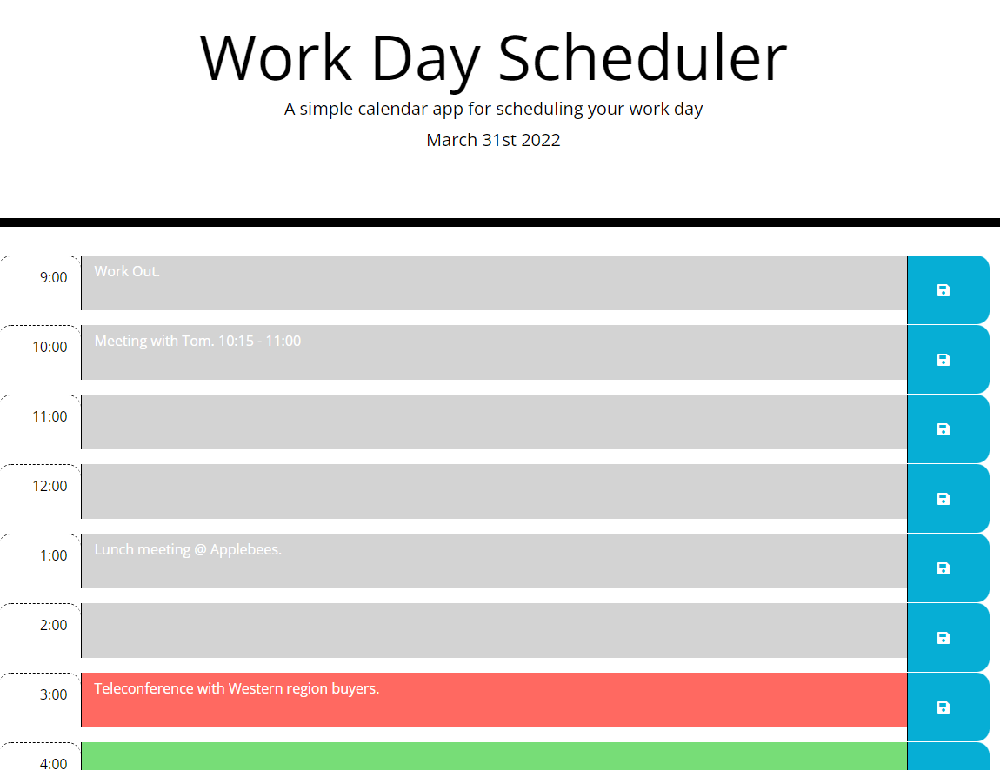
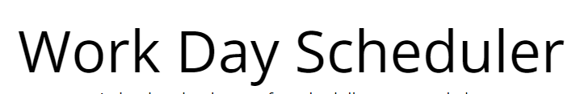

[![Contributors][contributors-shield]][contributors-url]
[![Forks][forks-shield]][forks-url]
[![Stargazers][stars-shield]][stars-url]
[![Issues][issues-shield]][issues-url]
[![MIT License][license-shield]][license-url]
[![LinkedIn][linkedin-shield]][linkedin-url]

<!-- PROJECT LOGO -->
 

  

  <h3 align="center">Daily Scheduler</h3>

  

    A web app to keep track of your daily tasks.
     
    <a href="https://github.com/powe0186/dailySchedule"><strong>Explore the docs »</strong></a>
     
     
    <a href="https://github.com/powe0186/dailySchedule/issues">Report Bug</a>

<!-- TABLE OF CONTENTS -->

  
Table of Contents

  <ol>
    <li>
      <a href="#about-the-project">About The Project</a>
      <ul>
        <li><a href="#built-with">Built With</a></li>
      </ul>
    </li>
    <li>
      <a href="#getting-started">Getting Started</a>
      <ul>
        <li><a href="#prerequisites">Prerequisites</a></li>
        <li><a href="#installation">Installation</a></li>
      </ul>
    </li>
    <li><a href="#usage">Usage</a></li>
    <li><a href="#roadmap">Roadmap</a></li>
    <li><a href="#contributing">Contributing</a></li>
    <li><a href="#license">License</a></li>
    <li><a href="#contact">Contact</a></li>
    <li><a href="#acknowledgments">Acknowledgments</a></li>
  </ol>

<!-- ABOUT THE PROJECT -->
## About The Project

This page allows you to input different events throughout your day and save them. Those events will still be there when you refresh your page, and when you close your browser and reopen thepage.

The Current date is shown at the top. Hours that have past will appear as grey, the current hourwill appear as green, and future hours will appear as red.

(<a href="#top">back to top</a>)

### Built With

* [Bootstrap](https://getbootstrap.com)
* [JQuery](https://jquery.com)

(<a href="#top">back to top</a>)

<!-- USAGE EXAMPLES -->
## Usage

CLick inside the time blocks to type. If you click the SAVE icon at the end of the row, it will save that task to the chosen your.

(<a href="#top">back to top</a>)

<!-- CONTACT -->
## Contact

Ben Powell- [@powe0186](https://twitter.com/powe0186)

Project Link: [https://github.com/powe0186/dailySchedule](https://github.com/powe0186/dailySchedule)

(<a href="#top">back to top</a>)

